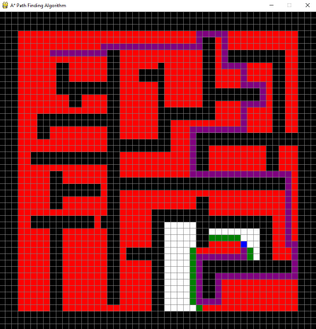

# A* Path Finding Algorithm Visualization

As described in [Introduction to the A* Algorithm](https://www.redblobgames.com/pathfinding/a-star/introduction.html),
A* algorithm is a searching algorithm that searches for the shortest path between the initial and the final state. It is used in various applications, such as maps.



## Execution

```
pip install -r requirements.txt
python a_star.py
```

Click anywhere on the grid with the right button and set squares:
1. Start position: <span style="color:cyan">cyan</span>
2. End position: <span style="color:blue">blue</span>
3. Barriers: <span style="color:black">black</span>
4. Press "space" and see how the A* Algorithm works
To undo some action you can click with the left button.

You can realize that the path is built by the <span style="color:purple">purple</span> squares connecting the end and start blocks.

Now do you want to execute this magic again?
So press "c" on your keyboard to clean the window and repeat steps 1 to 4.

## Definitions

```
f(n) = g(n) + h(n)
```

where:
- f is the cost function
- g is the actual cost from beginning
- h is the heuristic function (or the 'guess')

In this demonstration, the heuristic function used is Manhattan distance.

## Visualization
- PyGame
